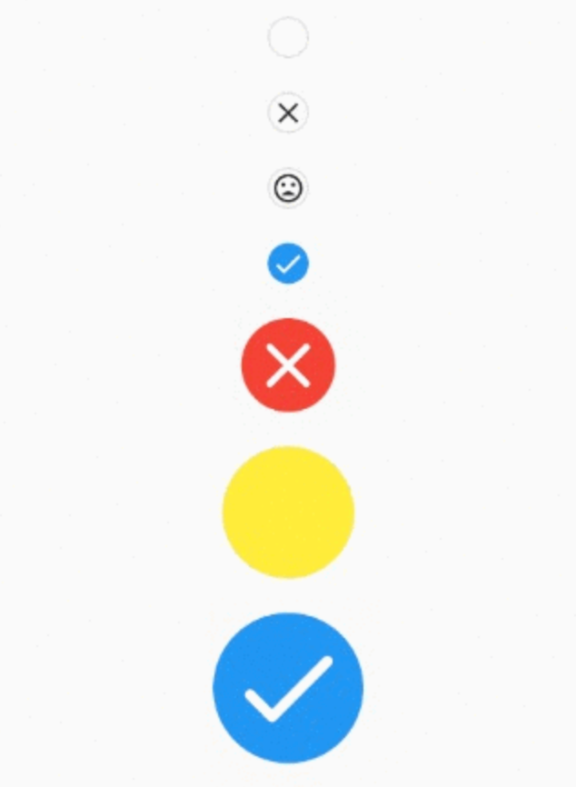

# Flutter Check Box Rounded

[](https://github.com/tenhobi/effective_dart)

## Description

Package created to give a fully functional and customizable rounded CheckBox.

### Installation

Add App Version Checker to your pubspec:

```yaml
dependencies:
  flutter_check_box_rounded: any # or the latest version on Pub
```

### Example

The most simple use is this one. A prepared round checkbox that has a callback when selected/unselected.

```dart
CheckBoxRounded(
 onTap: (bool? value) {},
),
```

That will generate this:

<!--  -->


## Customize to your needs
You can customize all sort of behaviors and look you want. You can do things like setting selected/unselected color, selected/unselected
widgets, duration of the animation, etc.

The next example show some of the customizations.

<!--  -->
